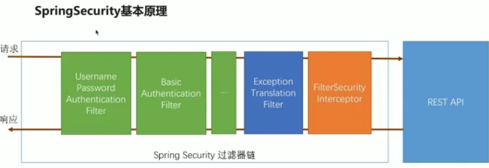
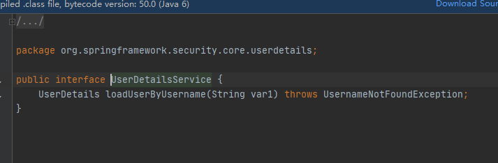
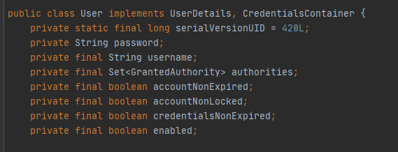
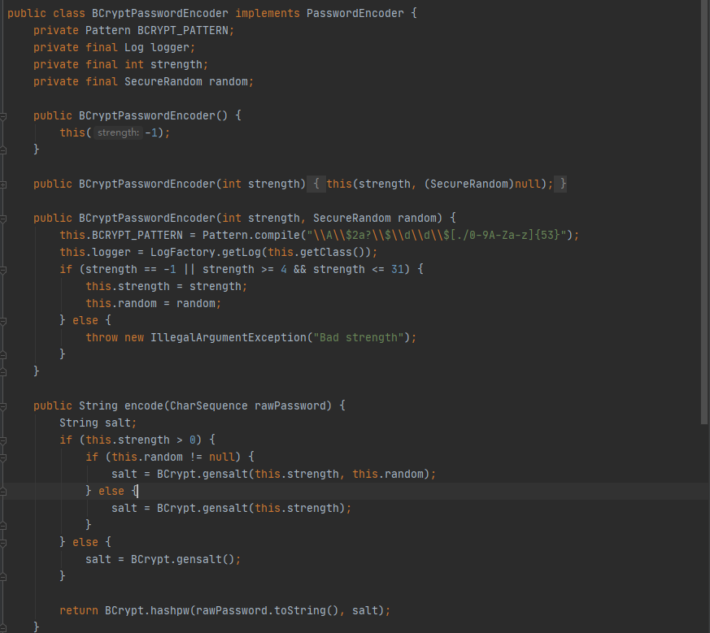
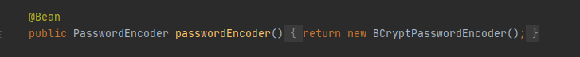
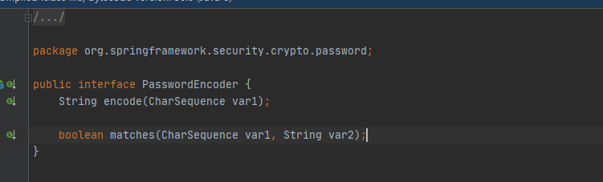

自定义用户认证逻辑：

1.处理用户信息获取：

SpringSecurity提供了一个接口UserDetailsService



提供了一个loadUserByUsername的方法，我们需要实现这个接口根据自己的数据库去查询，然后返回一个User对象



2.用户是否过期的校验：

SpringSecurity自带的user对象，authorities是拥有的权限

nonExpired 是账户没有过期，nonLocked账户是否锁定，credentialsNonExpired代表密码是否过期,enabled账户是否可用

3.密码的加密解密：



SpringSecurity提供了一个加密解密的类，放入数据库的时候需要encode

然后在配置中需要加入



如果你的数据库有另一套加密解密的方式



需要自己实现这个接口的加密解密方法

然后在配置中配置自定义的这个类


个性化登录页面：

 UsernamePasswordAuthenticationFilter中

```java
public UsernamePasswordAuthenticationFilter() {
        super(new AntPathRequestMatcher("/login", "POST"));
}
```

表示post请求的login接口是登录的接口

.loginPage 配置登录路径

.loginProceesingUrl 配置登录的接口


自定义跳转controller

```java
	//请求进来 SpringSecurity 会吧请求存到里面
	private RequestCache requestCache = new HttpSessionRequestCache();
	
	//SpringSecurity 提供页面的跳转
	private RedirectStrategy redirectStrategy = new DefaultRedirectStrategy();


	@RequestMapping(SecurityConstants.DEFAULT_UNAUTHENTICATION_URL)
	@ResponseStatus(code = HttpStatus.UNAUTHORIZED)
	public Response requireAuthentication(HttpServletRequest request, HttpServletResponse response) throws IOException     {
		//获取亲要求
		SavedRequest savedRequest = requestCache.getRequest(request, response);
		
		if (savedRequest != null) {
			String targetUrl = savedRequest.getRedirectUrl();
            //如果是以html结尾的 跳转到登录的页面
			if (StringUtils.endsWithIgnoreCase(targetUrl, ".html")) {
				redirectStrategy.sendRedirect(request, response, "登录页面")
			}
		}

		return new Response("未登录");
	}
```

